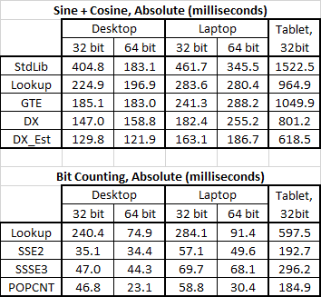
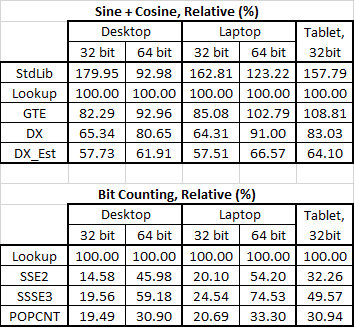
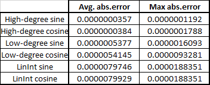

# A Case Against Lookup Tables
In many places on the internet, there’s an advice “to improve performance of your code, use a pre-calculated lookup table”.

My point is, now in 2016, in 80% cases, the advice is terribly wrong.

I’ve wrote a couple of benchmarks to demonstrate.

**The first test**, SinCos, calculates sine + cosine of random angles.

[Inspired by a question on stackoverflow](http://stackoverflow.com/q/31814105/126995).

I’ve implemented the following algorithms:

1. Standard C runtime library, i.e. sinf + cosf functions.
2. A lookup table, the length is 256 values, with linear interpolation between the values, and optimized for this test case (the test calculates both sin and cosine, so the table holds the sin and cos values in adjacent memory addresses).
3. Minimax high-degree (11 for sine, 12 for cosine) polynomial approximation, as implemented in [Geometric Tools](https://www.geometrictools.com/Source/Mathematics.html) library
4. Same polynomial approximation (11 for sine, 12 for cosine), as implemented in Microsoft DirectX SDK in [XMScalarSinCos](https://msdn.microsoft.com/en-us/library/windows/desktop/microsoft.directx_sdk.scalar.xmscalarsincos%28v=vs.85%29.aspx) . Slightly faster than the previous one because optimized for simultaneous sin+cos case I have in my test.
5. Lower-degree polynomial approximation (7 for sine, 6 for cosine), as implemented in Microsoft DirectX SDK by [XMScalarSinCosEst](https://msdn.microsoft.com/en-us/library/windows/desktop/microsoft.directx_sdk.scalar.xmscalarsincosest(v=vs.85).aspx)

**The second test**, BitCount, calculates count of set bits in the array of random 16-bit values.

[Inspired by a google interview question](http://www.gwan.com/blog/20160405.html), where an interviewer expected the incorrect “lookup table” answer.

In the question there were merely 10000 short values. On today's hardware, the data set is too small for meaningful benchmark. So my array is larger, with 100 million short values, taking about 190 MB RAM.

I’ve implemented following algorithms:

1. 256 bytes lookup table.
2. SSE2 manually vectorized.
3. SSSE3 manually vectorized.
4. XOP manually vectorized (untested because don't have the hardware).
5. POPCNT instruction.

The algorithms 2-4 are [from the SO](http://stackoverflow.com/a/17355341/126995).

## Hardware
Currently, I happen to have three PCs on my desk.

* A desktop with [i5-4460](http://ark.intel.com/products/80817/Intel-Core-i5-4460-Processor-6M-Cache-up-to-3_40-GHz), 16GB RAM, Windows 10 x64
* A laptop with [i5-2410m](http://ark.intel.com/products/52224/Intel-Core-i5-2410M-Processor-3M-Cache-up-to-2_90-GHz), 8GB RAM, Windows 8.1 x64.
* A tablet with Atom [Z3735](http://ark.intel.com/products/80275/Intel-Atom-Processor-Z3735G-2M-Cache-up-to-1_83-GHz), 1GB RAM, Windows 10 x86.

## Test Results

Here’s absolute values in milliseconds:



Here’s values in percent, relative to the lookup tables performance:



You see the pattern here?

In 100% of my test cases, using a lookup tables is not good for performance. And in some cases the difference is **huge**, like 7 times slower than other implementation.

## Final Words
The people who wrote that classic programming books, were using very old computers. Since those classic books were written, CPU computation speed improved by orders of magnitude compared to RAM latency. Even the highly-sophisticated multi-level caches only help to some extent. That's why on modern hardware, implementing a lookup table to save CPU time is very often a bad idea.

Sure, there are cases when a lookup tables indeed improves performance. Like when the content is really hard to compute, [rainbow tables](https://en.wikipedia.org/wiki/Rainbow_table) being the extreme example.

But please, stop using lookup tables for trivial things like trigonometry or bit counting. When running on modern hardware, a CPU computes stuff much faster than you think it does, and accesses memory much slower than you think it does.

Also, please stop writing and reading those deprecated programming books that teach people to use lookup tables to optimize performance.

## Bonus Chapter: Polynomial Approximation Precision

You might be wondering “polynomial approximation sounds scary, how precise is that thing?”

It’s very precise.

Even the low-degree approximation is more precise than my 256-values lookup table.

Here’s the data:



The app that calculates those errors is also in this repository, SinCosPolyPrecision subfolder.

Not only lookup table for sine and cosine is slower, it’s less precise as well.
